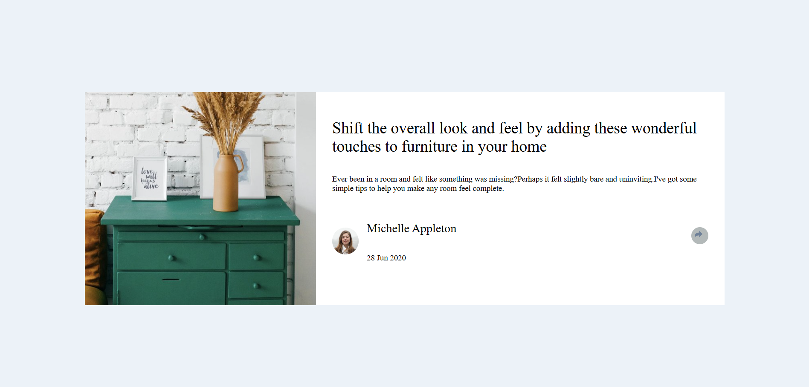

# 💡 Article Preview Component

This is my solution to the **Article Preview Component** challenge on [Frontend Mentor](https://www.frontendmentor.io/challenges/article-preview-component-dYBN_pYFT). It’s a responsive card layout that displays article details with a toggleable social share popup.

---

## 🔗 Live Demo

👉 [View Live Site](https://asthaaaaa07.github.io/fem-article-preview-component/)

---

## 🚀 Features

- ✅ Responsive layout (375px mobile & 1440px desktop)
- ✅ Social share icons toggle on click
- ✅ Flexbox-based card design
- ✅ Mobile-first approach with media queries
- ✅ Clean and accessible HTML structure

---

## 🛠️ Tech Stack

- **HTML5** – semantic structure
- **CSS3** – flexbox, media queries
- **JavaScript** – class toggling for interactivity
- **Git & GitHub** – version control and hosting

---

## 📱 Responsiveness

This project is fully responsive and optimized for:
- Mobile screens (`375px`)
- Desktop screens (`1440px`)
- Everything in between

---

## 🎯 What I Learned

- How to toggle classes using JavaScript (`classList.toggle`)
- How to align flex items inside a responsive layout
- Writing mobile-first CSS with media queries
- Improving structure with `section`, `div`, `h1`, and `img` elements
- Managing GitHub repo with local Git & authentication

---

## 📂 Folder Structure

├── index.html
├── frontend1.css
├── frontend1.js
├── images/
│ ├── avatar-michelle.jpg
│ ├── drawers.jpg
│ ├── icon-facebook.svg
│ ├── icon-pinterest.svg
│ ├── icon-share.svg
│ └── icon-twitter.svg
└── README.md

---

## 🙋‍♀️ About Me

I'm **Astha**, a passionate frontend developer exploring real-world projects and coding challenges to build my skills.

- 👩‍💻 Frontend Mentor: [@asthaaaaa07](https://www.frontendmentor.io/profile/asthaaaaa07)
- 💻 GitHub: [@asthaaaaa07](https://github.com/asthaaaaa07)
- 🌐 Portfolio: Coming soon!

---

## 💬 Feedback

Feel free to open an issue or drop feedback on my Frontend Mentor solution page! I'm always open to suggestions.

---

## 📌 Challenge Info

This challenge is from [Frontend Mentor](https://www.frontendmentor.io/challenges), a great platform to practice frontend skills through real-world UIs.

